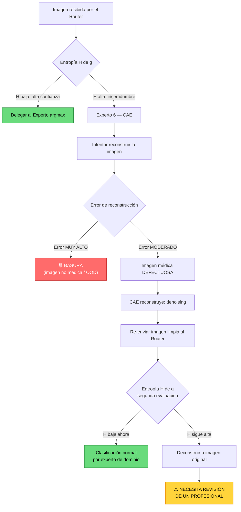

# Arquitectura del Sistema MoE — Clasificación Médica Multimodal

*Última actualización: 2026-03-28 | Autor: MNEMON (agente de memoria)Proyecto: Incorporar Elementos de IA — Unidad II, Bloque VisiónUniversidad Autónoma de Occidente — Pregrado Ingeniería de Datos / IA*

---

## Tabla de contenido

1. [Visión general del sistema](#1-visión-general-del-sistema)
2. [Hoja de ruta de desarrollo](#2-hoja-de-ruta-de-desarrollo)
3. [Expertos de dominio (1–5)](#3-expertos-de-dominio-15)
4. [Experto 6 — CAE (Experto de Incertidumbre)](#4-experto-6--cae-experto-de-incertidumbre)
5. [Diseño del router](#5-diseño-del-router)
6. [Pipeline de preprocesamiento de imagen](#6-pipeline-de-preprocesamiento-de-imagen)
7. [Pipeline de datos (Fase 0)](#7-pipeline-de-datos-fase-0)
8. [Dashboard interactivo (Fase 6)](#8-dashboard-interactivo-fase-6)
9. [Optimización de hardware](#9-optimización-de-hardware)
10. [Métricas de evaluación y umbrales mínimos](#10-métricas-de-evaluación-y-umbrales-mínimos)
11. [Restricciones de penalización](#11-restricciones-de-penalización)

---

## 1. Visión general del sistema

### 1.1 Propósito

El sistema es un **Mixture of Experts (MoE)** para clasificación de imágenes médicas multimodales. Recibe como única entrada una imagen o volumen médico (PNG, JPEG o NIfTI) y produce un diagnóstico clasificándolo a través del experto especializado correspondiente.

La pregunta científica central del proyecto:

> ¿Justifica el Vision Transformer su costo computacional como router frente a métodos estadísticos clásicos operando sobre los mismos embeddings?
> 

### 1.2 Composición: 5 + 1 expertos

El sistema contiene **6 expertos**, organizados en dos categorías:

| ID | Nombre | Tipo | Modalidad | Función |
| --- | --- | --- | --- | --- |
| 0 | Chest (NIH ChestXray14) | Dominio | Radiografía 2D | 14 patologías torácicas |
| 1 | ISIC 2019 | Dominio | Dermatoscopía 2D | 9 clases de lesiones cutáneas |
| 2 | OA-Knee | Dominio | Radiografía 2D | 3 grados osteoartritis (KL) |
| 3 | LUNA16 | Dominio | CT pulmonar 3D | Detección nódulos (binario) |
| 4 | Pancreas | Dominio | CT abdominal 3D | Detección PDAC (binario) |
| 5 | CAE (OOD) | Incertidumbre | Todas las modalidades | Reconstrucción + filtro de basura/defectos |

Los expertos 0–4 se entrenan con su dataset propio. El experto 5 (CAE) se entrena con **todos los datasets combinados** y se activa por entropía del router, no por routing directo.

> **Nota de aprobación:** La incorporación del Experto 6 (CAE) fue aprobada verbalmente por el profesor. La guía oficial define 5 expertos, pero esta extensión amplía la propuesta con un mecanismo de filtro de calidad de imagen. Como consecuencia, el vector de gating es `g ∈ ℝ^6` en lugar de `g ∈ ℝ^5`, y la función de pérdida incorpora un tercer término `β·L_error` que la guía no contempla pero el profesor autorizó.

> **Nota sobre los backbones de los expertos:**
> - Los modelos **ViT, CvT y Swin** se construyen **desde cero** con arquitectura predefinida (no son pesos preentrenados de ImageNet ni HuggingFace como punto de partida).
> - **DenseNet** es una arquitectura **propia/custom** diseñada desde cero para este proyecto.

### 1.3 Restricción absoluta: solo píxeles

El sistema **nunca** recibe metadatos, etiquetas de modalidad, nombres de archivo ni texto como entrada. La única entrada es el tensor de la imagen.

- Detección automática 2D/3D por el rango del tensor: `rank=4` → 2D, `rank=5` → 3D.
- Violación de esta restricción: **−20% en la nota del proyecto**.

### 1.4 Flujo general

```
Imagen/Volumen (sin metadatos)
        │
        ▼
Preprocesador Adaptativo
  • rank=4 → resize 224×224, normalización ImageNet
  • rank=5 → resize 64×64×64, normalización HU
        │
        ▼
Backbone compartido (ViT-Tiny / CvT-13 / Swin-Tiny)
  • Patch Embedding → tokens [B, N, d_model]
  • Transformer Blocks + Self-Attention
  • Extracción del CLS token: z ∈ ℝ^d_model
        │
        ▼
Router: softmax(W·z + b) → distribución sobre 6 expertos
        │
        ├── H(g) baja (alta confianza) → Experto argmax (0–4)
        │
        └── H(g) alta (incertidumbre) → Experto 5 (CAE)
```

> **Nota importante:** Además de ViT-Tiny, CvT-13 y Swin-Tiny, también se incluye **DenseNet custom** como backbone alternativo de embeddings propios, recomendado por el profesor para imágenes médicas 2D.

---

## 2. Hoja de ruta de desarrollo

### 2.1 Secuencia de 12 pasos

| # | Paso | Descripción | Fase pipeline | Estado |
| --- | --- | --- | --- | --- |
| 1 | Descargar datos | Descarga de los 5 datasets desde fuentes públicas | Fase 0 – Paso 1 | ✅ Completado |
| 2 | Extraer archivos | Descompresión de ZIPs, tarballs, NIfTI | Fase 0 – Paso 2 | ✅ Completado |
| 3 | Preparar datos | Splits 80/10/10, preprocesado por dominio, etiquetas | Fase 0 – Pasos 3–5 | 🔄 En progreso (Pancreas con error) |
| 4 | Generar embeddings | Backbone congelado extrae CLS tokens → `.npy` | Fase 1 | ⏳ Pendiente |
| 5.1 | Entrenar Experto 1 | Chest — ConvNeXt-Tiny, BCEWithLogitsLoss, 14 clases | Fase 2 | ⏳ Pendiente |
| 5.2 | Entrenar Experto 2 | ISIC — EfficientNet-B3, CrossEntropyLoss, 9 clases | Fase 2 | ⏳ Pendiente |
| 5.3 | Entrenar Experto 3 | OA — VGG16-BN, CrossEntropyLoss ordinal, 3 clases | Fase 2 | ⏳ Pendiente |
| 5.4 | Entrenar Experto 4 | LUNA16 — ViViT-Tiny 3D, FocalLoss, 2 clases | Fase 2 | ⏳ Pendiente |
| 5.5 | Entrenar Experto 5 | Páncreas — Swin3D-Tiny, FocalLoss, 2 clases | Fase 2 | ⏳ Pendiente |
| 5.6 | Entrenar Experto 6 | CAE sobre los 5 datasets combinados | Fase 3 | ⏳ Pendiente |
| 6 | Ablation study | Routers sobre expertos congelados (GMM, KNN, Linear, NB) | Fase 4 | ⏳ Pendiente |
| 7 | Escoger router | Seleccionar el mejor método de routing | Fase 4 | ⏳ Pendiente |
| 8 | Fine-tuning por etapas | Descongelar cabezas → fine-tuning global | Fase 5 | ⏳ Pendiente |
| 9 | Prueba con datos reales | Validación end-to-end con imágenes nuevas | — | ⏳ Pendiente |
| 10 | Verificación | Pruebas funcionales completas del sistema | — | ⏳ Pendiente |
| 11 | Página web | Interfaz web para inferencia interactiva | Fase 6 | ⏳ Pendiente |
| 12 | Dashboard | Dashboard + explicación del flujo arquitectónico | Fase 6 | ⏳ Pendiente |

### 2.2 Mapa de fases del pipeline

| Fase | Nombre | Descripción | Script orquestador |
| --- | --- | --- | --- |
| Fase 0 | Preparación de datos | Descarga, extracción, splits, parches 3D | `fase0_pipeline.py` |
| Fase 1 | Extracción de embeddings | Backbone congelado → vectores `.npy` | `fase1_pipeline.py` |
| Fase 2 | Entrenamiento de los 5 expertos | Fine-tuning individual de cada experto de dominio | `fase2_train_experts.py` |
| Fase 3 | Entrenamiento del Experto 6 (CAE) | Autoencoder convolucional para filtro OOD/basura | `fase3_train_cae.py` |
| Fase 4 | Ablation study del router | 4 métodos de routing comparados sobre expertos congelados | `fase4_ablation.py` |
| Fase 5 | Fine-tuning global | Sistema MoE completo, descongelamiento por etapas | `fase5_finetune_global.py` |
| Fase 6 | Despliegue web | Dashboard interactivo + API REST | `fase6_webapp.py` |

---

## 3. Expertos de dominio (1–5)

### 3.1 Experto 0 — Chest (NIH ChestXray14)

| Campo | Valor |
| --- | --- |
| **Dataset** | NIH ChestXray14 |
| **Modalidad** | Radiografía de tórax 2D |
| **Tarea** | Clasificación multilabel (14 patologías simultáneas) |
| **Arquitectura** | ConvNeXt-Tiny |
| **Loss** | `BCEWithLogitsLoss` con `pos_weight` (multilabel) |
| **Métricas** | AUC-ROC por clase + F1 Macro + AUPRC |
| **Volumen** | ~112K imágenes (train: 88,999 / val: 11,349 / test: 11,772) |
| **Preprocesado** | Resize 224×224, normalización ImageNet |
| **Split** | Por Patient ID (`train_val_list.txt` / `test_list.txt` oficiales) |

**Patologías (14):** Atelectasis, Cardiomegaly, Effusion, Infiltration, Mass, Nodule, Pneumonia, Pneumothorax, Consolidation, Edema, Emphysema, Fibrosis, Pleural_Thickening, Hernia.

**Notas críticas:**
- Etiquetas generadas por NLP — benchmark DenseNet-121 ≈ 0.81 AUC macro.
- AUC > 0.85 debe investigarse por posible confounding.
- **Nunca** usar Accuracy como métrica (~54% prediciendo siempre "No Finding").
- BBox disponible para 8/14 clases (~1,000 imágenes) — útil para validar heatmaps en dashboard.
- Filtro `View Position = PA` recomendado para estudios controlados.

### 3.2 Experto 1 — ISIC 2019 (Lesiones cutáneas)

| Campo | Valor |
| --- | --- |
| **Dataset** | ISIC 2019 (HAM10000 + BCN_20000 + MSK) |
| **Modalidad** | Dermatoscopía 2D |
| **Tarea** | Clasificación multiclase (8 clases en train, UNK solo en test) |
| **Arquitectura** | EfficientNet-B3 |
| **Loss** | `CrossEntropyLoss` con `class_weights` |
| **Métricas** | BMCA (oficial) + AUC-ROC por clase |
| **Volumen** | ~25K imágenes |
| **Preprocesado** | Resize 224×224, ColorJitter agresivo |
| **Split** | Por `lesion_id` (función `build_lesion_split`) |

**Notas críticas:**
- 3 fuentes con bias de dominio — augmentación agresiva obligatoria.
- 9 neuronas en la capa de salida (incluye slot UNK para inferencia).
- Sin `metadata_csv` → riesgo de leakage entre fuentes.
- UNK en inferencia → H(g) alta → Experto 5 OOD la captura.

### 3.3 Experto 2 — OA Knee (Osteoartritis de rodilla)

| Campo | Valor |
| --- | --- |
| **Dataset** | Osteoarthritis Knee X-ray |
| **Modalidad** | Radiografía de rodilla 2D |
| **Tarea** | Clasificación ordinal (3 clases: Normal KL0 / Leve KL1-2 / Severo KL3-4) |
| **Arquitectura** | VGG16-BN |
| **Loss** | `CrossEntropyLoss` con `class_weights` (opción pragmática) u `OrdinalLoss(n_classes=3)` |
| **Métricas** | QWK (Quadratic Weighted Kappa) — **no** Accuracy ni F1 |
| **Volumen** | ~8,260 imágenes base |
| **Preprocesado** | CLAHE → resize 224×224 (CLAHE **siempre** antes del resize) |
| **Split** | Directorios `oa_splits/{train,val,test}/` |

**Notas críticas:**
- Augmentación offline ya aplicada — **no** augmentar de nuevo en runtime.
- Sin Patient ID — documentar como limitación.
- KL1 contamina la frontera Clase 0 ↔︎ Clase 1 (la más difícil).
- **Nunca** usar `RandomVerticalFlip` (anatomía simétrica solo horizontalmente).
- Matriz de costos para penalización ordinal disponible:
`[[0, 1, 4],    [1, 0, 1],    [4, 1, 0]]`

### 3.4 Experto 3 — LUNA16 (Cáncer de pulmón)

| Campo | Valor |
| --- | --- |
| **Dataset** | LUNA16 / LIDC-IDRI |
| **Modalidad** | CT pulmonar 3D (parches, no volúmenes completos) |
| **Tarea** | Clasificación binaria de parches (nódulo sí/no) |
| **Arquitectura** | ViViT-Tiny (3D) |
| **Loss** | `FocalLoss(gamma=2, alpha=0.25)` — obligatoria |
| **Métricas** | CPM + FROC (`noduleCADEvaluationLUNA16.py`) |
| **Tensor** | `[B, 1, 64, 64, 64]` — parche centrado en candidato (x, y, z) |
| **Preprocesado** | HU clip [-1000, 400] → normalización [0, 1] |

**Notas críticas:**
- Desbalance extremo ~490:1 — BCELoss produce modelo trivial (siempre clase 0).
- **Siempre** usar `candidates_V2.csv` (V1 obsoleto, 24 nódulos menos).
- Conversión world→vóxel con `LUNA16PatchExtractor.world_to_voxel()`.
- Gradient checkpointing obligatorio (batch=4, FP16, 12GB VRAM).
- Techo teórico de sensibilidad: 94.4%.
- Spacing variable entre volúmenes — verificado en `__init__`.

### 3.5 Experto 4 — Páncreas (PANORAMA / Zenodo)

| Campo | Valor |
| --- | --- |
| **Dataset** | PANORAMA / Zenodo CT abdominal |
| **Modalidad** | CT abdominal 3D |
| **Tarea** | Clasificación binaria de volumen (PDAC+ / PDAC−) |
| **Arquitectura** | Swin3D-Tiny |
| **Loss** | `FocalLoss(alpha=0.75, gamma=2)` |
| **Métricas** | AUC-ROC > 0.85 (bueno); baseline nnU-Net ≈ 0.88 |
| **Volumen** | ~281 volúmenes — k-fold CV (k=5) obligatorio |
| **Preprocesado** | HU clip [-100, 400] (**no** [-1000, 400]), z-score por volumen |

**Notas críticas:**
- Etiquetas en repositorio GitHub separado — fijar hash del commit.
- Páncreas ocupa ~1% del volumen → resize naïve destruye la señal diagnóstica.
- HU clip diferente al de LUNA16: `HU_ABDOMEN_CLIP = (-100, 400)`.
- z-score por volumen para compensar bias multicéntrico (Radboudumc/MSD/NIH).
- batch_size=1–2 + FP16 + gradient checkpointing (más restrictivo que LUNA16).
- **Estado actual:** ❌ Dataset no descargado (`datasets/zenodo_13715870/` solo contiene `.gitkeep`). Bloqueante para Fase 2.

### 3.6 Orden de entrenamiento del sistema completo

Basado en las notas directas del profesor:

1. **Fase 2:** Entrenar los 5 expertos de dominio por separado hasta que converjan bien.
2. **Congelar gradientes:** Una vez convergidos, se aplica `freeze` a todos los expertos (sus pesos no se actualizan más).
3. **Fase 3:** Entrenar el Experto 6 (CAE) con los 5 datasets combinados.
4. **Fase 4:** Con todos los expertos congelados, conectar y entrenar el **router**.
   - El router recibe las métricas de los expertos como señal de pérdida combinada.
   - Aprende a enrutar según si le fue bien o mal con cada experto.
5. **Fase 5:** Fine-tuning global (descongelar cabezas → fine-tuning progresivo).

> **Analogía del profesor:** el router actúa como un "celador/guachimán" — solo aprende a dirigir el tráfico porque ya sabe qué experto es bueno para cada tipo de imagen.

---

## 4. Experto 6 — CAE (Experto de Incertidumbre)

### 4.1 Concepto

> ⚠️ **ACLARACIÓN FUNDAMENTAL: El Experto 6 NO clasifica patologías.** Su función exclusiva es actuar como filtro de calidad de imagen durante la inferencia. Solo recibe una imagen cuando el router no tiene suficiente confianza para delegarla a ninguno de los 5 expertos de dominio.

El sexto experto es un **Convolutional AutoEncoder (CAE)** entrenado sobre los 5 datasets de dominio combinados. Su función no es clasificar patologías — es detectar y gestionar las imágenes que el router no sabe a dónde enviar.

### 4.2 Condición de activación

El CAE se activa cuando la distribución de routing `g = softmax(W·z + b)` tiene **entropía alta**, lo que indica que el router está indeciso sobre qué experto de dominio debe procesar la imagen.

- **Entropía baja** en `g` → alta confianza → delegar al `argmax(g)` (experto 0–4)
- **Entropía alta** en `g` → incertidumbre → delegar al experto 5 (CAE)
- Umbral de entropía calibrado sobre el set de validación (percentil 95 de `H(g)`)

### 4.3 Pipeline de reconstrucción y decisión

El CAE no clasifica la imagen directamente. Intenta **reconstruir** la imagen y toma decisiones basadas en la calidad de la reconstrucción (error de reconstrucción).

### Flujo completo:

```
Imagen con H(g) alta
        │
        ▼
    CAE: Encoder → Latent → Decoder
        │
        ▼
    Calcular error de reconstrucción (MSE / L1)
        │
        ├── Error MUY ALTO ──────────────► Clasificar como "BASURA"
        │                                  (no es imagen médica: gato, ruido, etc.)
        │
        └── Error MODERADO ──────────────► Imagen médica DEFECTUOSA
                    │                       (borrosa, corrupta, artefactos)
                    │
                    ▼
              CAE reconstruye la imagen (denoising)
                    │
                    ▼
              Re-enviar imagen limpia al ROUTER
                    │
                    ├── Router ahora tiene H(g) baja ──► Clasificación normal
                    │
                    └── Router SIGUE con H(g) alta ────► CAE recibe de nuevo
                                │
                                ▼
                          Deconstruir a imagen original
                                │
                                ▼
                          Etiquetar: "NECESITA REVISIÓN DE UN PROFESIONAL"
```

### 4.4 Diagrama Mermaid del árbol de decisión



### 4.5 Clases de salida del Experto 6

El CAE produce exactamente dos etiquetas de salida:

| Etiqueta | Significado | Criterio |
| --- | --- | --- |
| **"basura"** | La imagen es completamente ajena a imagenología médica (foto de un gato, ruido aleatorio, captura de pantalla, etc.) | Error de reconstrucción muy alto — el CAE no puede reconstruir algo que nunca vio |
| **"necesita revisión"** | La imagen es legítimamente médica pero está defectuosa (borrosa, corrupta, con artefactos graves) y tras limpieza sigue siendo ambigua para el router | Error moderado + re-routing fallido |

### 4.6 Entrenamiento del CAE

- **Datos de entrenamiento:** los 5 datasets de dominio combinados (no un dataset aparte).
- **Objetivo:** minimizar el error de reconstrucción sobre imágenes médicas legítimas.
- **Resultado:** el CAE aprende la distribución de "imágenes médicas válidas". Cualquier imagen fuera de esta distribución produce un error de reconstrucción alto.
- **Fase del pipeline:** Fase 3 (después de entrenar los 5 expertos de dominio).

**Notas adicionales sobre el entrenamiento:**
- El CAE se entrena con los 5 datasets combinados para aprender la distribución de imágenes médicas válidas.
- **Durante el entrenamiento, el CAE no recibe imágenes por el router.** Solo en inferencia recibe imágenes cuando el router tiene entropía alta.
- **Riesgo del "router perezoso":** si el CAE aprende demasiado bien de todo tipo de imagen, el router se volvería perezoso y le enviaría todo al Experto 6 porque siempre daría métricas positivas. Esto colapsa la lógica MoE. La `L_error` en la función de pérdida total existe precisamente para penalizar este comportamiento.

### 4.7 Feedback loop con el router

Durante el entrenamiento del router (Fase 1 y Fase 5), el sistema incluye un término de pérdida `L_error` que penaliza al router cuando delega una imagen médica válida al Experto 6. Este feedback entrena al router a **no enviar** imágenes legítimas al CAE.

```
L_total = L_task + α·L_aux + β·L_error
```

- `L_task`: pérdida de clasificación del experto seleccionado
- `L_aux`: pérdida auxiliar de balance de carga (Switch Transformer)
- `L_error`: penalización por delegar imágenes válidas al Experto 6
- `β` se calibra para que el Experto 6 solo reciba OOD real

---

## 5. Diseño del router

### 5.1 Entrada y salida

- **Entrada:** vector de embedding `z ∈ ℝ^d_model` extraído por el backbone compartido (CLS token)
- **Salida:** distribución de probabilidad sobre los expertos: `g = softmax(W·z + b) ∈ ℝ^6`
- **Sin metadatos:** el router opera exclusivamente sobre la representación aprendida de los píxeles

### 5.2 Lógica de entropía

La entropía de Shannon de la distribución de routing determina la acción:

```
H(g) = -Σ g_i · log(g_i)
```

| Condición | Interpretación | Acción |
| --- | --- | --- |
| `H(g)` baja | El router está seguro de un experto | Delegar al `argmax(g)` (experto 0–4) |
| `H(g)` alta | El router no distingue entre expertos | Delegar al experto 5 (CAE) |

**Calibración del umbral:** percentil 95 de `H(g)` sobre el set de validación (`ENTROPY_PERCENTILE = 95` en `fase2_config.py`). El 5% de las muestras más confusas se tratan como OOD en inferencia.

### 5.3 Ablation study: 4 métodos de routing

El núcleo científico del proyecto compara 4 routers sobre los mismos embeddings:

| Router | Tipo | Parámetros clave | Naturaleza |
| --- | --- | --- | --- |
| **Linear + Softmax** | Paramétrico (gradiente) | LR=1e-3, 50 épocas, batch=512, α ∈ [0.01, 0.1] — calibrar en val | Deep Learning |
| **GMM** | Paramétrico (EM) | 5 componentes, covarianza `full`, max_iter=200 | Estadístico |
| **Naive Bayes** | MLE analítico | Estimación máxima verosimilitud | Estadístico |
| **k-NN (FAISS)** | No paramétrico | k=5, distancia coseno, suavizado Laplace ε=0.01 | Estadístico |

**Protocolo del ablation:**
1. Fase 1 extrae embeddings con el backbone congelado → `Z_train`, `Z_val`, `Z_test` en disco
2. Cada router entrena/ajusta sobre `Z_train`
3. Se evalúa routing accuracy + balance de carga + latencia sobre `Z_val`
4. El ganador se selecciona por routing accuracy **solo si** cumple la restricción de balance de carga
5. Resultados se guardan en `ablation_results.json`
6. Calibración de α: barrer α ∈ {0.01, 0.02, 0.05, 0.10} sobre Z_val monitoreando el cociente max(f_i)/min(f_i). Registrar el α óptimo en ablation_results.json.

> **Importante sobre el balance de carga en el ablation:** La restricción `max(f_i)/min(f_i) ≤ 1.30` y la penalización de −40% se aplican **exclusivamente al router ViT+Linear en el sistema final**. Los routers estadísticos (GMM, Naive Bayes, k-NN) **no tienen L_aux** y no están sujetos a esta penalización durante el ablation study. En el ablation se monitorea el balance como métrica comparativa, pero no descalifica a un router estadístico.

### 5.4 Restricción de balance de carga

```
max(f_i) / min(f_i) ≤ 1.30
```

Donde `f_i` es la fracción de muestras asignadas al experto `i` (sobre los expertos 0–4 de dominio).

- En el ablation study, un router estadístico que viole este umbral **se penaliza en el ranking** pero no es automáticamente descalificado (no tienen L_aux). El router ViT+Linear **sí está sujeto a descalificación** si viola el umbral en el sistema final desplegado.
- Violación en el sistema final: **−40% en la nota del proyecto**.
- La Auxiliary Loss del Switch Transformer (`L_aux = α · N · Σ f_i · P_i`) se usa en el router Linear para forzar el balance durante el entrenamiento.

### 5.5 Backbones disponibles

| Backbone | `d_model` | VRAM | Uso previsto |
| --- | --- | --- | --- |
| `vit_tiny_patch16_224` (default) | 192 | ~2GB | Primera corrida, iteración rápida |
| `cvt_13` | 384 | ~3GB | Balance intermedio |
| `swin_tiny_patch4_window7_224` | 768 | ~4GB | Ablation study final |

### 5.6 Fases de entrenamiento del router

| Fase | Qué se entrena | Qué está congelado | LR | Épocas |
| --- | --- | --- | --- | --- |
| Fase 1 (Router solo) | Router (W, b) | Backbone + 5 expertos | 1e-3 | ~50 |
| Fase 2 (Cabezas) | Router + cabezas clasificadoras | Backbone + capas convolucionales | 1e-4 | ~30 |
| Fase 3 (Global) | Todo (Backbone + Router + Expertos) | Nada | 1e-6 | 7–10 |

**Regla crítica en Fase 3:** NO reiniciar el optimizer — se pierden los momentos acumulados de fases anteriores.

> **Nota de diseño (divergencia consciente con la guía):** La guía oficial propone LR=1e-5 en la Fase 3 global. Este proyecto usa LR=1e-6 de forma deliberada: dado que el sistema integra 6 expertos heterogéneos (2D y 3D), un learning rate más bajo en la fase global minimiza el riesgo de desestabilizar los expertos ya convergidos, especialmente los modelos 3D con gradientes más inestables. Se acepta convergencia más lenta a cambio de mayor estabilidad.

---

## 6. Pipeline de preprocesamiento de imagen

### 6.1 Formato de entrada: `.mha`

El formato preferido para imágenes médicas es `.mha` (MetaImage), porque:
- Preserva el **volumen 3D interno** completo.
- Soporta el rango de **Unidades Hounsfield (HU): −1000 a +3000**, muy superior al rango 0–255 de JPG/RGB.
- A diferencia de JPG o PNG (3 dimensiones máx.), `.mha` permite trabajar con la profundidad real del volumen sin destruirla.

> ⚠️ **Advertencia crítica:** pasar la 3ª dimensión del vóxel directamente al canal RGB destruye el volumen médico. Esta estrategia está **prohibida** en este proyecto.

---

### 6.2 Orden de pasos del preprocesamiento

Secuencia recomendada por el profesor (combinada con los papers de referencia PMC9340712 y el estudio de CLAHE/Gamma en teledermatoscopía):

| Paso | Técnica | Justificación |
|---|---|---|
| 1 | **Resize estandarizado** | Sin interpolación agresiva. Evita píxeles degradados. |
| 2 | **Total Variation Filter (TVF)** | Denoising pixel a pixel. Elimina incertidumbre sin perder bordes. |
| 3 | **Gamma Correction** | Realza brillo y estructuras. Mejora accuracy y convergencia más rápida. |
| 4 | **CLAHE local** (histograma adaptativo por zonas) | Mejor diferenciación de tejidos. Recomendación directa del profesor. Usarlo para embeddings de modelos, **no** para interpretación humana directa. |
| 5 | **Guardar el `transform`** antes de normalizar | Permite recuperar el factor de redimensionalidad para generar mapas de calor (Grad-CAM). |
| 6 | **Generar tensor 5D normalizado** | Soporta imágenes 2D y 3D simultáneamente. La profundidad varía entre sistemas pero la dimensionalidad se mantiene consistente. |
| 7 | **Pasar por cada backbone de forma independiente** | Cada modelo (ViT, CvT, Swin, DenseNet) recibe su propio tensor redimensionado. |

> **Regla del profesor:** "Los filtros redimensionan la imagen → guardar el `transform` antes de normalizar embeddings. Un método que normalice Y que a la salida permita recuperar el factor de redimensionalidad para generar mapas de calor."

---

### 6.3 Tensor 5D y detección de dimensionalidad

La guía oficial establece que la detección 2D/3D es automática por el **rank del tensor de entrada**:
- `rank=4` → imagen 2D: `[B, C, H, W]`
- `rank=5` → volumen 3D: `[B, C, D, H, W]`

Esta detección opera en la **interfaz de entrada del preprocesador** (antes de cualquier transformación). Internamente, una vez detectada la dimensionalidad, el sistema normaliza la representación a un **tensor 5D unificado** para el procesamiento:

```
Entrada 2D (rank=4):  [B, C, H, W]      →  expande D=1  →  [B, C, 1, H, W]
Entrada 3D (rank=5):  [B, C, D, H, W]   →  se mantiene  →  [B, C, D, H, W]
```

- La detección sigue el criterio de la guía (rank del tensor de entrada).
- El procesamiento interno usa siempre estructura 5D para código unificado entre 2D y 3D.
- Al extraer embeddings, cada backbone recibe el tensor en el formato que le corresponde.

---

### 6.4 Tabla de input por backbone

| Modelo | Origen | Input recomendado | Tipo de embeddings |
|---|---|---|---|
| **ViT** | Desde cero (arq. predefinida) | Parches 2D de slices del volumen | Transformer sobre secuencia de patches |
| **CvT** | Desde cero (arq. predefinida) | Convolutions + Transformer híbrido | Captura local + global |
| **Swin** | Desde cero (arq. predefinida) | Ventanas deslizantes sobre slices | Eficiente para volúmenes grandes |
| **DenseNet** | Arquitectura **propia/custom** | Imagen 2D por canal/slice | Embeddings ricos con conexiones densas |

> **Nota del profesor:** "Hacer embeddings ricos es bueno." No depender solo de ImageNet. DenseNet custom + TVF + Gamma = mejor resultado según PMC9340712.

---

### 6.5 Data Leak Prevention

Estrategia en dos niveles para evitar filtraciones entre splits:

1. **Primer nivel — Metadata DICOM (`.dcm`):**
   - El formato DICOM contiene metadata + imagen en un solo archivo.
   - Comparar primero por metadata (rápido, barato computacionalmente).
   - Si la metadata falla o es idéntica, pasar al siguiente nivel.

2. **Segundo nivel — PHash (Perceptual Hashing):**
   - Reduce dimensiones con coseno discreto.
   - Extrae frecuencias bajas/bordes del contenido.
   - Genera una huella hexadecimal corta para comparación eficiente.
   - Alternativas: histograma de píxeles o comparación píxel a píxel (más exacto pero más costoso).

---

### 6.6 Aumento de datos sintéticos (técnica del profesor)

El profesor propone una técnica propia para generación de imágenes sintéticas de alta precisión:

1. Entrenar un **encoder-decoder** completo.
2. Descartar el encoder entrenado.
3. Conectar **Smooth** (genera vectores tabulares a partir de distribuciones) al decoder.
4. Los vectores tabulares de Smooth pasan al decoder para **recrear imágenes sintéticas nuevas** muy precisas.

Esta técnica produce imágenes médicas sintéticas superiores a augmentación estándar (flip, crop, rotate) para datos de baja disponibilidad (ej: Páncreas con ~281 volúmenes).

---

## 7. Pipeline de datos (Fase 0)

### 7.1 Pasos de Fase 0

| Paso | Descripción | Estado | Tiempo |
| --- | --- | --- | --- |
| 0 | Prerrequisitos (SimpleITK, etc.) | ✅ | 0.0s |
| 1 | Descargar datasets | ✅ | 8,773.7s (~2.4h) |
| 2 | Extraer archivos | ✅ | 0.4s |
| 3 | Post-procesado NIH | ✅ | 6.1s |
| 4 | Etiquetas páncreas | ✅ | 679.7s |
| 5 | Splits 80/10/10 | ⚠️ parcial | 3.0s |
| 6 | Datos 3D (parches) | ⚠️ parcial | 162.2s |
| 7 | Parche CvT-13 | ⚠️ | 7.3s |
| 8 | Reporte | — | — |

### 7.2 Estado actual de los datos en disco (2026-03-25)

| Dataset | Descargado | Extraído | Splits | Procesado |
| --- | --- | --- | --- | --- |
| NIH ChestXray14 | ✅ | ✅ | ✅ `splits/nih_*.txt` | N/A |
| ISIC 2019 | ✅ | ✅ | ✅ `splits/isic_*.csv` | N/A |
| OA Knee | ✅ | ✅ | ✅ `oa_splits/{train,val,test}/` | N/A |
| LUNA16 | ✅ (meta+CT) | ✅ | ✅ `luna_splits.json` | ⚠️ `patches/` sin `test/` |
| Pancreas | ❌ vacío | ❌ | ❌ | ❌ |

### 7.3 Bloqueantes

**Páncreas:** `datasets/zenodo_13715870/` solo contiene `.gitkeep`. Fase 2 exige las 5 clases `{0,1,2,3,4}` en `y_train`. Sin páncreas (experto 4), Fase 2 fallará. Se debe ejecutar Fase 0 con `--solo pancreas` antes de continuar.

**LUNA16 test:** el directorio `patches/test/` no existe. Los parches de train y val sí están disponibles.

### 7.4 Splits generados

| Dataset | Train | Val | Test | Método de split |
| --- | --- | --- | --- | --- |
| NIH | 88,999 | 11,349 | 11,772 | Patient ID (listas oficiales) |
| ISIC | — | — | — | `lesion_id` (`build_lesion_split`) |
| OA | — | — | — | Directorios pre-existentes |
| LUNA | — | — | ⚠️ sin test | `seriesuid` |
| Pancreas | ❌ | ❌ | ❌ | k-fold CV (k=5), 10% test fijo |
| CAE | ✅ (skipped) | — | — | Combinación de los 5 datasets |

### 7.5 Artefactos producidos por Fase 0 → consumidos por Fase 1

Fase 1 es consumidora pura de los artefactos de Fase 0:
- Splits (archivos `.txt`, `.csv`, directorios)
- Parches 3D preprocesados (`.npy`)
- Etiquetas cruzadas (páncreas: `pancreas_splits.csv`)
- Reporte de estado (`fase0_report.md`)
- Comando de ejecución para Fase 1 (generado en el paso 8)

---

## 8. Dashboard interactivo (Fase 6)

### 8.1 Funcionalidades obligatorias (requeridas por la guía)

La guía oficial establece explícitamente las siguientes 8 funcionalidades:

| # | Funcionalidad | Descripción | Estado |
|---|---|---|---|
| 1 | **Carga de imagen** | Soporta PNG, JPEG, NIfTI. Detecta automáticamente 2D/3D por rank del tensor. | ⏳ Pendiente |
| 2 | **Preprocesado transparente** | Muestra dimensiones originales y adaptadas tras el preprocesador. | ⏳ Pendiente |
| 3 | **Inferencia en tiempo real** | Devuelve etiqueta, confianza (%) y tiempo de respuesta en milisegundos. | ⏳ Pendiente |
| 4 | **Attention Heatmap del Router ViT** | Mapa de calor sobre la imagen original. Usa Grad-CAM con el `transform` guardado en el paso 5 del preprocesamiento. | ⏳ Pendiente |
| 5 | **Panel del experto activado** | Muestra nombre del experto, arquitectura, dataset de entrenamiento y gating score asignado. | ⏳ Pendiente |
| 6 | **Panel del ablation study** | Tabla comparativa de Routing Accuracy de los 4 métodos sobre el set de validación. | ⏳ Pendiente |
| 7 | **Gráfica de Load Balance** | Barras con `f_i` acumulado desde que arrancó el sistema, en tiempo real. | ⏳ Pendiente |
| 8 | **Alerta OOD** | Alerta visual cuando la entropía H(g) > umbral calibrado (percentil 95). Indica si la imagen fue al Experto 6 (CAE). | ⏳ Pendiente |

### 8.2 Conexión con el pipeline

- **Funcionalidad 4 (Heatmap):** requiere que el `transform` del preprocesamiento esté guardado por cada inferencia (paso 5 de §6.2). Sin este artefacto, Grad-CAM no puede mapear la activación al espacio original de la imagen.
- **Funcionalidad 6 (Ablation):** se alimenta de `ablation_results.json` generado en Fase 4.
- **Funcionalidad 7 (Load Balance):** se alimenta de un contador en memoria actualizado en cada inferencia. Se resetea al reiniciar el servicio.
- **Funcionalidad 8 (OOD):** se alimenta del umbral calibrado en `fase4_ablation.py` (percentil 95 de H(g)).

### 8.3 Artefactos previos necesarios para el dashboard

| Artefacto | Generado en | Consumido por |
|---|---|---|
| `ablation_results.json` | Fase 4 | Funcionalidad 6 |
| `entropy_threshold.pkl` | Fase 4 | Funcionalidad 8 |
| `preprocessing_transform.pkl` (por inferencia) | Preprocesador (§6.2) | Funcionalidad 4 |
| Pesos de los 6 expertos + router | Fases 2, 3, 5 | Funcionalidades 3, 5 |

---

## 9. Optimización de hardware

### 9.1 Configuración de hardware de trabajo

| Característica | Valor |
|---|---|
| **GPU de trabajo** | 1 × 20 GB VRAM (máquina personal) |
| **GPU de referencia (guía)** | 2 × 12 GB VRAM (máquina del profesor) |
| **Estrategia** | Desarrollar y validar en 1×20 GB. Si se migra a 2×12 GB, activar `nn.DataParallel`. |

> **Decisión:** Se trabaja primero (y posiblemente de forma exclusiva) con la máquina personal de 1×20 GB. La guía fue redactada para 2×12 GB, pero 20 GB unificados ofrecen mayor flexibilidad para modelos 3D sin necesidad de DataParallel.

### 9.2 Técnicas obligatorias de optimización de memoria

| Técnica | Obligatoria | Configuración | Aplica a |
|---|---|---|---|
| **FP16 Mixed Precision** | Sí | `torch.cuda.amp.autocast()` | Todos los modelos |
| **Gradient Accumulation** | Sí | `ACCUMULATION_STEPS=4`, batch efectivo=32 | Todos los entrenamientos |
| **Gradient Checkpointing** | Sí (3D) | `model.gradient_checkpointing_enable()` | Expertos 3D (LUNA16, Páncreas) |
| **DataParallel** | Condicional | `nn.DataParallel(model)` | Solo si se migra a 2×12 GB |

> **Gradient Accumulation:** con batch real de 8 imágenes y `ACCUMULATION_STEPS=4`, el sistema simula un batch efectivo de 32 sin cargar 32 imágenes simultáneamente en GPU. Crítico para modelos 3D con tensores grandes.

### 9.3 Presupuesto VRAM estimado por fase

| Componente | VRAM estimada | Técnica de control |
|---|---|---|
| Backbone ViT-Tiny (d=192) | ~2 GB | — |
| Backbone Swin-Tiny (d=768) | ~4 GB | — |
| Experto 3D LUNA16 (ViViT, batch=4) | ~8–10 GB | FP16 + grad. checkpoint |
| Experto 3D Páncreas (Swin3D, batch=1–2) | ~10–12 GB | FP16 + grad. checkpoint |
| Sistema MoE completo (Fase 5) | ~15–18 GB | FP16 + grad. accum. + checkpoint |

> El límite objetivo es **< 19 GB** para dejar margen de seguridad en la GPU de 20 GB. La guía menciona < 11.5 GB por tarjeta para 2×12 GB — en nuestra configuración el límite efectivo es ~19 GB total.

---

## 10. Métricas de evaluación y umbrales mínimos

### 10.1 Umbrales obligatorios de la rúbrica

Los siguientes umbrales aparecen en la rúbrica de evaluación del proyecto (§13 de `proyecto_moe.md`) y son **criterios de calificación**, no valores de referencia:

| Métrica | Umbral "Full marks" | Umbral "Aceptable" | Aplica a |
|---|---|---|---|
| **F1 Macro — Expertos 2D** | > 0.72 | > 0.65 | Chest, ISIC, OA-Knee |
| **F1 Macro — Expertos 3D** | > 0.65 | > 0.58 | LUNA16, Páncreas |
| **Routing Accuracy** | > 0.80 (mejor router) | — | Ablation study (Fase 4) |
| **Load Balance max/min** | < 1.30 | — | Router ViT+Linear en producción (**penalización −40%** si supera) |

### 10.2 Métrica OOD — umbral a validar empíricamente

La guía fija un umbral orientativo de **OOD AUROC > 0.80** pero no lo incluye en la rúbrica de calificación como criterio de penalización. Sin embargo, dado que el Experto 6 (CAE) es una extensión aprobada verbalmente, se establece este umbral como objetivo interno:

> **Compromiso:** el AUROC del Experto 6 como detector OOD debe justificarse empíricamente sobre un conjunto de imágenes no médicas (OOD sintéticas) vs. imágenes médicas del set de validación. El valor de 0.80 es el umbral mínimo aceptable internamente; si no se alcanza, se revisará la arquitectura del CAE.

### 10.3 Restricción de VRAM

La guía menciona `< 11.5 GB por tarjeta` para la configuración 2×12 GB. En nuestra configuración de **1×20 GB**, el objetivo equivalente es:

> **< 19 GB total de VRAM** durante el entrenamiento del sistema completo (Fase 5). Superarlo implica ajustar batch size, reducir `d_model` del backbone, o activar gradient accumulation más agresivo.

### 10.4 Resultados orientativos del ablation (referencia, no umbrales)

La guía incluye una tabla de resultados **aproximados esperados** bajo el título *"Tabla Comparativa Esperada (Guía de Resultados)"*. Son rangos orientativos, **no umbrales evaluables**:

| Router | Routing Acc. esperada | Latencia esperada | VRAM esperada |
|---|---|---|---|
| Linear + Softmax (ViT) | ~85–92% | ~8 ms | ~1.5 GB |
| GMM | ~78–87% | ~3 ms | ~50 MB |
| Naive Bayes | ~72–82% | ~1 ms | ~5 MB |
| k-NN (FAISS) | ~75–85% | ~5 ms | ~85 MB |

> La guía establece explícitamente: *"No hay un resultado correcto predefinido. Lo que se evalúa es la calidad del experimento, la honestidad del análisis y la profundidad de la discusión."*

### 10.5 Preparación del reporte técnico por fases

Para facilitar la redacción del reporte técnico final (≤ 7 páginas), cada fase del pipeline debe generar un **mini-reporte de resultados** con:

| Fase | Artefacto de reporte | Contenido mínimo |
|---|---|---|
| Fase 0 | `fase0_report.md` | Estado de datos, splits, bloqueantes |
| Fase 1 | `fase1_report.md` | Dimensión de embeddings, tiempo extracción, distribución por clase |
| Fase 2 | `fase2_report.md` | Métricas por experto (F1, AUC), curvas de aprendizaje, comparación con umbrales §10.1 |
| Fase 3 | `fase3_report.md` | Error de reconstrucción del CAE, distribución OOD vs. in-distribution |
| Fase 4 | `fase4_report.md` | Tabla comparativa 4 routers, Routing Accuracy, balance de carga, α óptimo |
| Fase 5 | `fase5_report.md` | Métricas end-to-end, curvas fine-tuning, análisis de load balance final |

> Estos mini-reportes son la materia prima del reporte técnico formal. Generarlos durante el desarrollo evita tener que reconstruir resultados al final.

---

## 11. Restricciones de penalización

El proyecto tiene dos restricciones de evaluación con penalización explícita sobre la nota.

### 11.1 Restricción 1 — Solo píxeles (−20%)

| Campo | Detalle |
| --- | --- |
| **Restricción** | El sistema recibe **únicamente** la imagen o volumen como entrada |
| **Prohibido** | Metadatos, etiquetas de modalidad, nombres de archivo, texto, información de dataset |
| **Detección 2D/3D** | Automática por rango del tensor (`rank=4` → 2D, `rank=5` → 3D) |
| **Penalización** | −20% sobre la nota final del proyecto |
| **Alcance** | Todo el pipeline: preprocesado, backbone, router, expertos, inferencia, dashboard |

**Implicación práctica:** ningún componente del sistema puede recibir una variable que indique "esta imagen viene del dataset X" o "esta imagen es una radiografía de tórax". El router debe descubrirlo solo a partir del embedding del backbone.

### 11.2 Restricción 2 — Balance de carga (−40%)

| Campo | Detalle |
| --- | --- |
| **Restricción** | `max(f_i) / min(f_i) ≤ 1.30` sobre los expertos de dominio (0–4) |
| **Definición** | `f_i` = fracción de muestras asignadas al experto `i` |
| **Penalización** | −40% sobre la nota final del proyecto |
| **Mecanismo de control** | Auxiliary Loss del Switch Transformer: `L_aux = α · N · Σ f_i · P_i` |
| **Parámetro** | `LOAD_BALANCE_THRESHOLD = 1.30` en `fase2_config.py` |
| **Alcance** | Solo el router ViT+Linear en producción. Los routers estadísticos del ablation no tienen L_aux. |

**Implicación práctica:** si el router envía el 40% de las imágenes al experto Chest y solo el 10% al experto LUNA16, la ratio sería 4.0, violando masivamente el umbral. La L_aux penaliza activamente este desequilibrio durante el entrenamiento del router Linear.

**Nota:** el experto 6 (CAE/OOD) no cuenta para el cálculo de balance de carga. Solo los expertos 0–4 de dominio participan en la ratio.

---

*Documento generado por MNEMON — agente de memoria del proyecto MoE Médico.Fuentes: `config.py`, `fase2_config.py`, `fase0_report.md`, `arquitectura.md`, `flujo_arquitectura.md`, `proyecto_moe.md`, especificación del arquitecto.*
