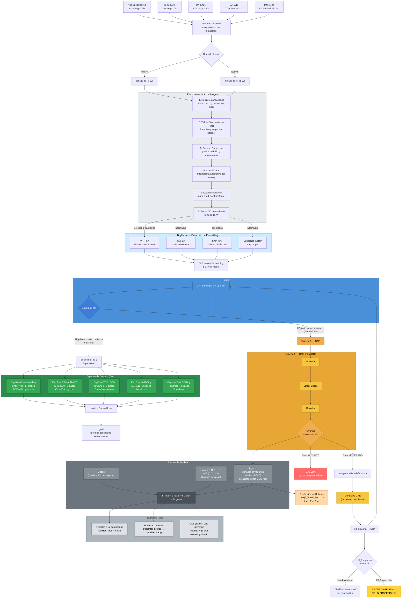

```mermaid
graph TD
    %% ============================================================
    %% DATASETS DE ENTRADA
    %% ============================================================
    DS0["NIH ChestXray14<br/>112K imgs · 2D"]
    DS1["ISIC 2019<br/>25K imgs · 2D"]
    DS2["OA-Knee<br/>8.2K imgs · 2D"]
    DS3["LUNA16<br/>CT pulmonar · 3D"]
    DS4["Páncreas<br/>CT abdominal · 3D"]

    DS0 & DS1 & DS2 & DS3 & DS4 --> INPUT["Imagen / Volumen<br/>(solo píxeles, sin metadatos)"]

    %% ============================================================
    %% DETECCIÓN DE DIMENSIONALIDAD
    %% ============================================================
    INPUT --> DIM{"Rank del tensor"}
    DIM -->|"rank=4"| R2D["2D: (B, C, H, W)"]
    DIM -->|"rank=5"| R3D["3D: (B, C, D, H, W)"]

    %% ============================================================
    %% PREPROCESAMIENTO
    %% ============================================================
    subgraph PREPROC["Preprocesamiento de Imagen"]
        P1["1. Resize estandarizado<br/>224×224 (2D) / 64×64×64 (3D)"]
        P2["2. TVF — Total Variation Filter<br/>(denoising sin perder bordes)"]
        P3["3. Gamma Correction<br/>(realce de brillo y estructuras)"]
        P4["4. CLAHE local<br/>(histograma adaptativo por zonas)"]
        P5["5. Guardar transform<br/>(para Grad-CAM posterior)"]
        P6["6. Tensor 5D normalizado<br/>(B, C, D, H, W)"]
        P1 --> P2 --> P3 --> P4 --> P5 --> P6
    end

    R2D --> P1
    R3D --> P1

    %% ============================================================
    %% BACKBONES
    %% ============================================================
    subgraph BACKBONE["Backbone — Extracción de Embeddings"]
        B1["ViT-Tiny<br/>d=192 · desde cero"]
        B2["CvT-13<br/>d=384 · desde cero"]
        B3["Swin-Tiny<br/>d=768 · desde cero"]
        B4["DenseNet custom<br/>arq. propia"]
    end

    P6 -->|"Se elige 1 backbone"| B1
    P6 -.->|"alternativa"| B2
    P6 -.->|"alternativa"| B3
    P6 -.->|"alternativa"| B4

    B1 --> CLS["CLS token / Embedding<br/>z ∈ ℝ^d_model"]
    B2 --> CLS
    B3 --> CLS
    B4 --> CLS

    %% ============================================================
    %% ROUTER
    %% ============================================================
    subgraph ROUTER["Router"]
        GATE["g = softmax(W·z + b) ∈ ℝ⁶"]
        ENTROPY{"Entropía H(g)"}
        GATE --> ENTROPY
    end

    CLS --> GATE

    ENTROPY -->|"H(g) baja → alta confianza<br/>argmax(g)"| EXPERT_SELECT["Selección Top-1<br/>Experto 0–4"]
    ENTROPY -->|"H(g) alta → incertidumbre<br/>(percentil 95)"| CAE_ENTRY["Experto 5 — CAE"]

    %% ============================================================
    %% EXPERTOS DE DOMINIO
    %% ============================================================
    subgraph EXPERTS["Expertos de Dominio (0–4)"]
        EXP0["Exp 0 — ConvNeXt-Tiny<br/>Chest NIH · 14 clases<br/>BCEWithLogitsLoss"]
        EXP1["Exp 1 — EfficientNet-B3<br/>ISIC 2019 · 9 clases<br/>CrossEntropyLoss"]
        EXP2["Exp 2 — VGG16-BN<br/>OA-Knee · 3 clases<br/>CrossEntropyLoss"]
        EXP3["Exp 3 — ViViT-Tiny<br/>LUNA16 · 2 clases<br/>FocalLoss"]
        EXP4["Exp 4 — Swin3D-Tiny<br/>Páncreas · 2 clases<br/>FocalLoss"]
    end

    EXPERT_SELECT --> EXP0
    EXPERT_SELECT --> EXP1
    EXPERT_SELECT --> EXP2
    EXPERT_SELECT --> EXP3
    EXPERT_SELECT --> EXP4

    EXP0 & EXP1 & EXP2 & EXP3 & EXP4 --> LOGITS["Logits × Gating Score"]
    LOGITS --> LTASK["L_task<br/>(pérdida del experto seleccionado)"]

    %% ============================================================
    %% EXPERTO 6 — CAE (OOD / Incertidumbre)
    %% ============================================================
    subgraph CAE["Experto 5 — CAE (Filtro OOD)"]
        CAE_ENC["Encoder"]
        CAE_LAT["Latent Space"]
        CAE_DEC["Decoder"]
        CAE_ERR{"Error de<br/>reconstrucción"}

        CAE_ENC --> CAE_LAT --> CAE_DEC --> CAE_ERR
    end

    CAE_ENTRY --> CAE_ENC

    CAE_ERR -->|"Error MUY ALTO"| BASURA["BASURA<br/>(no es imagen médica)"]
    CAE_ERR -->|"Error MODERADO"| DEFECT["Imagen médica defectuosa"]

    DEFECT --> DENOISE["Denoising CAE<br/>(reconstrucción limpia)"]
    DENOISE --> REROUTE["Re-enviar al Router"]
    REROUTE --> GATE

    REROUTE --> CHECK{"H(g) segunda<br/>evaluación"}
    CHECK -->|"H(g) baja ahora"| CLASIF["Clasificación normal<br/>por experto 0–4"]
    CHECK -->|"H(g) sigue alta"| REVISION["NECESITA REVISIÓN<br/>DE UN PROFESIONAL"]

    %% ============================================================
    %% FUNCIÓN DE PÉRDIDA
    %% ============================================================
    subgraph LOSS["Función de Pérdida"]
        LTASK_IN["L_task<br/>(clasificación del experto)"]
        LAUX["L_aux = α·N·Σ f_i·P_i<br/>α ∈ (0.01, 0.1)<br/>(balance de carga)"]
        LERROR["L_error<br/>(penaliza enviar imgs válidas al CAE)<br/>β calibrado para OOD real"]
        LTOTAL["L_total = L_task + α·L_aux + β·L_error"]
        LTASK_IN --> LTOTAL
        LAUX --> LTOTAL
        LERROR --> LTOTAL
    end

    LTASK --> LTASK_IN
    GATE --> LAUX
    CAE_ERR --> LERROR

    %% ============================================================
    %% BALANCE DE CARGA
    %% ============================================================
    LAUX --> BALANCE["Restricción de Balance<br/>max(f_i)/min(f_i) ≤ 1.30<br/>(solo Exp 0–4)"]

    %% ============================================================
    %% BACKWARD PASS
    %% ============================================================
    subgraph BACKWARD["Backward Pass"]
        GRAD_NO["Expertos 0–4: congelados<br/>requires_grad = False"]
        GRAD_YES["Router + Cabezas<br/>gradientes activos → optimizer.step()"]
        GRAD_CAE["CAE (Exp 5): solo inferencia<br/>cuando H(g) alta<br/>no routing directo"]
    end

    LTOTAL --> GRAD_NO
    LTOTAL --> GRAD_YES
    LTOTAL --> GRAD_CAE

    %% ============================================================
    %% ESTILOS
    %% ============================================================
    style ROUTER fill:#4a90d9,stroke:#2c5f9e,color:#fff
    style GATE fill:#4a90d9,stroke:#2c5f9e,color:#fff
    style ENTROPY fill:#3b7dd8,stroke:#2c5f9e,color:#fff

    style EXPERTS fill:#2d8a4e,stroke:#1a6334,color:#fff
    style EXP0 fill:#34a853,stroke:#1a6334,color:#fff
    style EXP1 fill:#34a853,stroke:#1a6334,color:#fff
    style EXP2 fill:#34a853,stroke:#1a6334,color:#fff
    style EXP3 fill:#34a853,stroke:#1a6334,color:#fff
    style EXP4 fill:#34a853,stroke:#1a6334,color:#fff

    style CAE fill:#e8a735,stroke:#b8860b,color:#000
    style CAE_ENTRY fill:#f0ad4e,stroke:#b8860b,color:#000
    style CAE_ENC fill:#f5c542,stroke:#b8860b,color:#000
    style CAE_LAT fill:#f5c542,stroke:#b8860b,color:#000
    style CAE_DEC fill:#f5c542,stroke:#b8860b,color:#000
    style CAE_ERR fill:#f0ad4e,stroke:#b8860b,color:#000
    style BASURA fill:#ff6b6b,stroke:#c92a2a,color:#fff
    style REVISION fill:#ffd43b,stroke:#e67700,color:#000
    style DENOISE fill:#f5c542,stroke:#b8860b,color:#000

    style LOSS fill:#6c757d,stroke:#495057,color:#fff
    style LTASK_IN fill:#868e96,stroke:#495057,color:#fff
    style LAUX fill:#868e96,stroke:#495057,color:#fff
    style LERROR fill:#868e96,stroke:#495057,color:#fff
    style LTOTAL fill:#495057,stroke:#343a40,color:#fff

    style BACKWARD fill:#adb5bd,stroke:#6c757d,color:#000
    style GRAD_NO fill:#dee2e6,stroke:#6c757d,color:#000
    style GRAD_YES fill:#dee2e6,stroke:#6c757d,color:#000
    style GRAD_CAE fill:#dee2e6,stroke:#6c757d,color:#000

    style PREPROC fill:#e9ecef,stroke:#adb5bd,color:#000
    style BACKBONE fill:#d0ebff,stroke:#74c0fc,color:#000

    style BALANCE fill:#ffd8a8,stroke:#e8590c,color:#000
```
