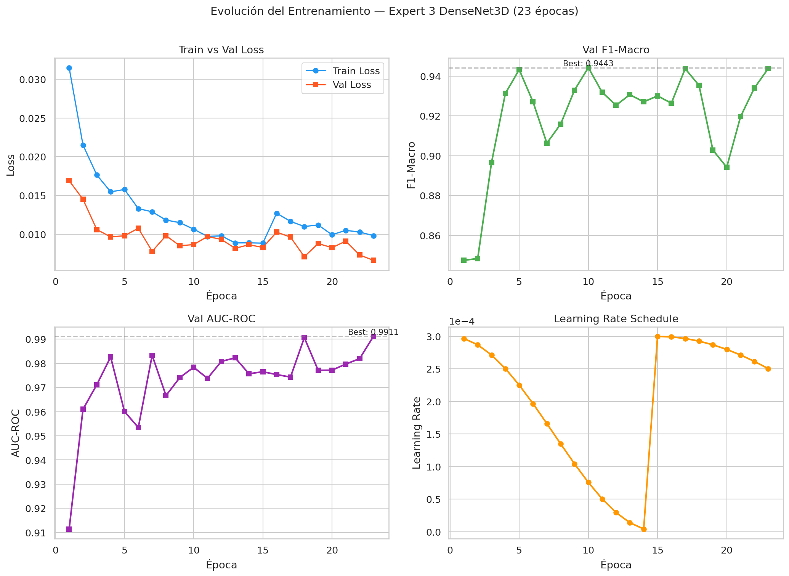
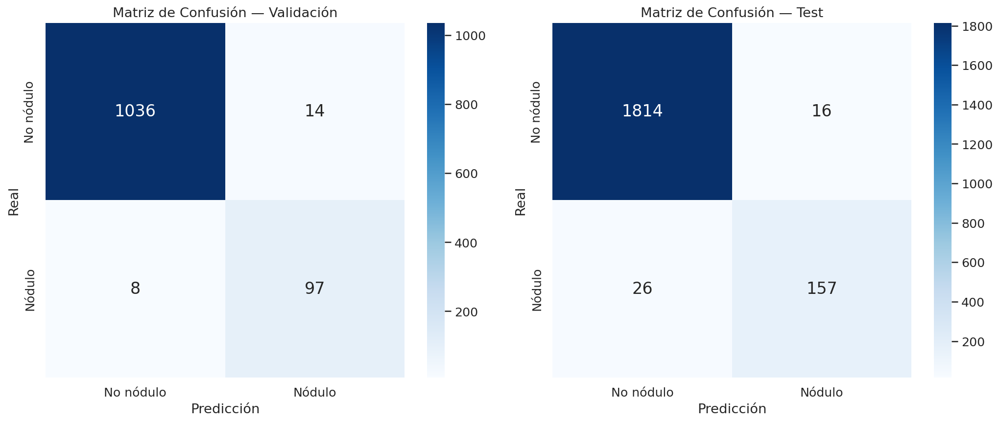
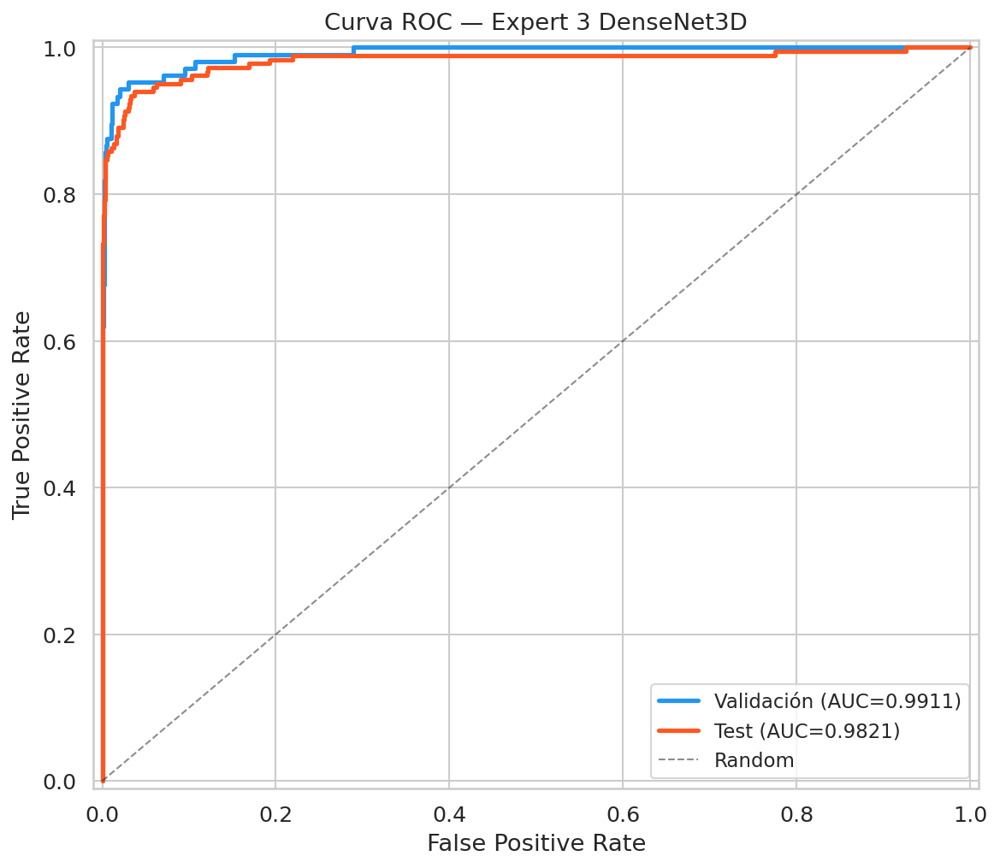
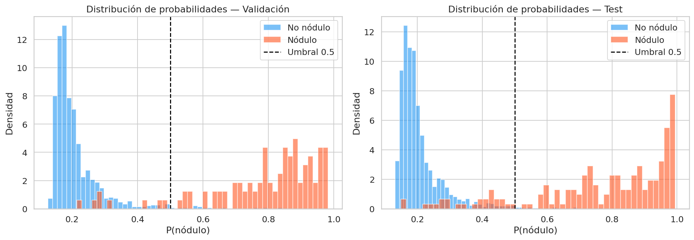
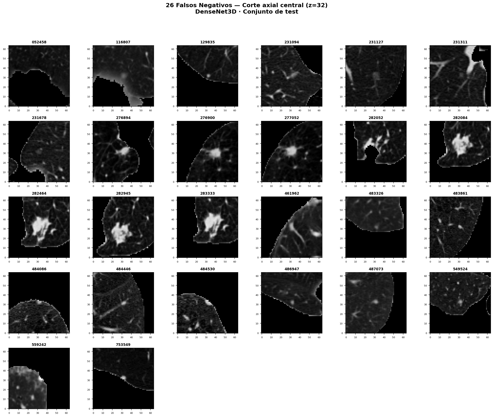

# Experto 3: Detección de nódulos pulmonares (LUNA16)

## Informe técnico de entrenamiento y validación

---

## 1. Contexto del dataset (Dataset seleccionado)

**LUNA16** (LUng Nodule Analysis 2016) es un benchmark público derivado del dataset **LIDC-IDRI** (Lung Image Database Consortium and Image Database Resource Initiative). Fue organizado como un challenge abierto con el objetivo de estandarizar la evaluación de algoritmos de detección automática de nódulos pulmonares en tomografías computarizadas (CT) de tórax.

El dataset contiene **888 estudios CT** adquiridos con distintos equipos y protocolos clínicos. Cada estudio fue revisado por al menos cuatro radiólogos independientes, y se retuvieron como anotaciones de consenso aquellos nódulos marcados por al menos tres de los cuatro lectores. El resultado son **1,186 nódulos anotados** con diámetros entre **3 mm y 30 mm** aproximadamente, aunque la distribución se concentra entre 4 mm y 15 mm. Los datos se distribuyen en formato **MHD/RAW** (derivado del formato MetaImage), con los volúmenes ya reconstruidos como arrays 3D. La información de anotación se proporciona como coordenadas (x, y, z) del centro del nódulo y su diámetro en milímetros.

La modalidad de imagen es **tomografía computarizada (CT)**, donde cada vóxel codifica un valor de atenuación en **unidades Hounsfield (HU)**. Los valores HU van desde -1000 (aire) hasta +3000 (hueso denso/metal), y el tejido pulmonar normal se sitúa típicamente entre -900 y -500 HU, mientras que los nódulos sólidos aparecen entre -200 y +150 HU. La **resolución espacial** varía entre estudios: el espaciado en el plano axial oscila entre 0.5 mm y 1.0 mm, y el espaciado entre cortes va de 0.6 mm a 2.5 mm, lo que hace necesario un remuestreo isotrópico durante el preprocesamiento.

El problema técnico principal de LUNA16 es el **desbalance extremo de clases**. En un volumen CT típico de 512 × 512 × ~300 vóxeles, un nódulo ocupa unas pocas decenas de miles de vóxeles frente a millones de vóxeles de tejido sano, vasos sanguíneos, bronquios y artefactos. A esto se suma la variabilidad anatómica entre pacientes, las diferencias en protocolos de adquisición (dosis, grosor de corte, kernel de reconstrucción) y la variabilidad inter-observador en la anotación, donde nódulos pequeños o subpleurales generan discrepancia incluso entre radiólogos experimentados. En nuestro dataset preprocesado, el conjunto de entrenamiento contiene **14,728 muestras** (1,258 positivas y 13,470 negativas), con un ratio de desbalance de aproximadamente **10.7:1**.

Desde el punto de vista clínico, la detección de nódulos pulmonares es el primer paso en la cadena de diagnóstico temprano de **cáncer de pulmón**, la causa de muerte por cáncer más frecuente a nivel mundial. Un sistema de detección asistida por computadora (CADe) que reduzca los nódulos no detectados (falsos negativos) sin generar una cantidad inmanejable de falsos positivos tiene valor directo en programas de screening poblacional.

La métrica de evaluación estándar en LUNA16 es la **curva FROC** (Free-Response Receiver Operating Characteristic), que mide la **sensibilidad** del detector en función del número promedio de **falsos positivos por escaneo**. El score FROC oficial se calcula como la media de la sensibilidad en siete puntos de operación predefinidos: 0.125, 0.25, 0.5, 1, 2, 4 y 8 FP/escaneo. Los mejores sistemas publicados alcanzan scores FROC por encima de 0.95.

---

## 2. Preprocesamiento y transformaciones (Offline)

Las siguientes transformaciones se aplican a los volúmenes CT antes de alimentar el modelo, durante la fase de preparación de datos.

1. **Conversión a unidades Hounsfield (HU).** Se aplican los factores de rescale slope e intercept almacenados en los metadatos del estudio para convertir los valores crudos de píxel a la escala HU estandarizada.
   - *Justificación:* Los valores crudos dependen del fabricante y los parámetros del escáner. La conversión a HU garantiza que un mismo tejido tenga el mismo valor numérico independientemente del equipo de adquisición.

2. **Clipping de intensidad a rango [-1000, 400] HU.** Los valores fuera de este rango se truncan a los límites del intervalo.
   - *Justificación:* Por debajo de -1000 HU solo hay aire puro, y por encima de +400 HU se encuentran hueso cortical denso y artefactos metálicos, ninguno de los cuales aporta información útil para la detección de nódulos. El clipping reduce la influencia de outliers en la normalización posterior y define un rango dinámico de 1400 HU.

3. **Remuestreo isotrópico a 1.0 mm × 1.0 mm × 1.0 mm.** Se utiliza interpolación cúbica (spline de orden 3) para llevar todos los volúmenes a una resolución espacial uniforme.
   - *Justificación:* Los estudios originales tienen espaciados heterogéneos, especialmente en el eje Z (entre cortes). Sin remuestreo, un nódulo de 6 mm de diámetro ocuparía un número diferente de vóxeles en dos estudios distintos, lo que dificulta el aprendizaje de representaciones consistentes.

4. **Segmentación de campos pulmonares.** Se genera una máscara binaria del parénquima pulmonar mediante umbralización a -400 HU seguida de operaciones morfológicas (erosión, dilatación, selección del componente conexo más grande, relleno de huecos).
   - *Justificación:* Excluir el mediastino, la pared torácica y el tejido subcutáneo reduce el volumen de datos que el modelo debe procesar y elimina regiones anatómicas donde los nódulos pulmonares no aparecen. También reduce los falsos positivos por estructuras de alta densidad fuera del pulmón.

5. **Normalización a rango [0, 1].** Los valores HU clipeados se escalan linealmente al intervalo [0, 1] dividiendo por el rango dinámico (1400 HU).
   - *Justificación:* Llevar los valores a un rango acotado facilita la convergencia del optimizador y estandariza la escala de entrada independientemente de los parámetros de adquisición.

6. **Zero-centering (resta de media global).** Se resta la media de intensidad calculada sobre el conjunto de entrenamiento. El valor utilizado es **0.09921630471944809**, lo que deja los datos en un rango aproximado de **[-0.099, 0.901]**.
   - *Justificación:* Centrar los datos alrededor de cero facilita la convergencia del optimizador al evitar sesgos sistemáticos en las activaciones de las primeras capas.

7. **Extracción de parches 3D (crops) centrados en candidatos.** Se recortan subvolúmenes de tamaño fijo **64 × 64 × 64 vóxeles** centrados en las coordenadas de cada nódulo anotado y en una selección de candidatos negativos (puntos sin nódulo). Las etiquetas se obtienen del archivo `candidates_V2.csv` (754K filas), indexado por `candidate_index` extraído del nombre de archivo.
   - *Justificación:* Operar sobre el volumen completo (512 × 512 × ~300 después de remuestreo) es computacionalmente prohibitivo para entrenamiento con batch sizes razonables. Los parches centrados en candidatos reducen el problema a una clasificación binaria sobre regiones locales, manteniendo suficiente contexto anatómico alrededor del nódulo.

8. **Almacenamiento en formato NumPy (.npy).** Los parches preprocesados se guardan en disco para evitar repetir el pipeline en cada época.
   - *Justificación:* El preprocesamiento de un volumen CT completo toma entre 5 y 15 segundos (dependiendo del remuestreo). Con 888 estudios y múltiples parches por estudio, repetir esto en cada época es un cuello de botella innecesario. El almacenamiento offline permite un data loading eficiente durante el entrenamiento. No se aplica normalización adicional en runtime: los parches ya están completamente normalizados en disco.

---

## 3. Estrategia de data augmentation (On-the-fly)

Las siguientes transformaciones se aplican aleatoriamente a cada parche 3D durante el entrenamiento, con el objetivo de ampliar la diversidad efectiva del dataset y reducir el sobreajuste. La implementación se encuentra en `LUNA16Dataset._augment_3d()` y se reutiliza vía herencia en `LUNA16ExpertDataset`.

1. **Flips aleatorios en los tres ejes.** Se aplica un flip (espejado) en cada eje con probabilidad independiente de 0.5.
   - *Justificación:* Los pulmones tienen simetría bilateral aproximada, y la anatomía local alrededor de un nódulo no cambia su identidad al reflejarse. El flip triplica la variabilidad geométrica sin coste computacional.

2. **Rotaciones aleatorias 3D.** Rotación del parche en ángulos uniformemente distribuidos entre **-15° y +15°** alrededor de tres planos: axial (ejes 1,2), coronal (ejes 0,2) y sagital (ejes 0,1). Se utiliza interpolación de orden 1 con modo `nearest`. Las rotaciones con ángulo inferior a 0.5° se omiten.
   - *Justificación:* Los nódulos no tienen orientación preferente dentro del pulmón. Rotaciones pequeñas enseñan al modelo que la orientación espacial del parche es irrelevante para la clasificación, sin introducir artefactos de interpolación graves que distorsionen la morfología del nódulo.

3. **Escalado aleatorio (zoom).** Se reescala el parche con un factor uniformemente distribuido entre **0.80 y 1.20**, seguido de un crop o padding central al tamaño original.
   - *Justificación:* Los nódulos anotados varían en tamaño de 3 mm a 30 mm. El escalado aleatorio simula parte de esa variabilidad y obliga al modelo a reconocer nódulos de tamaños ligeramente diferentes a los del conjunto de entrenamiento.

4. **Traslación espacial.** Se desplaza el centro del parche hasta **±4 vóxeles**, con zero-padding en los bordes.
   - *Justificación:* Las anotaciones de centro del nódulo tienen incertidumbre inherente (variabilidad inter-observador de 1-2 mm). El jitter posicional hace al modelo tolerante a pequeños errores de localización y reduce la dependencia del centrado exacto.

5. **Deformación elástica.** Se genera un campo de desplazamiento aleatorio con **σ ∈ [1, 3] vóxeles** y **α ∈ [0, 5] mm**, aplicado mediante `map_coordinates` con orden 1. Se aplica con **probabilidad 0.5**.
   - *Justificación:* Las diferencias anatómicas reales entre pacientes (forma del pulmón, posición de vasos, tamaño de los lóbulos) producen deformaciones no rígidas del tejido. La deformación elástica simula esa variabilidad de forma controlada y es particularmente efectiva en imágenes médicas, donde la cantidad de datos etiquetados es limitada.

6. **Perturbaciones de intensidad (tres componentes):**
   - **Ruido gaussiano aditivo** (P=0.5): σ ∈ [0, 25 HU] / 1400 ≈ **[0, 0.0179]** en escala normalizada.
   - **Brillo y contraste** (siempre): factor multiplicativo ∈ [0.9, 1.1], offset ∈ [-20, 20] HU / 1400.
   - **Blur gaussiano** (P=0.5): σ ∈ **[0.1, 0.5] vóxeles**.
   - *Justificación:* El ruido cuántico en las adquisiciones CT varía según la dosis de radiación y el protocolo. Las variaciones en los parámetros del escáner (kVp, mAs, kernel de reconstrucción) producen diferencias sistemáticas en la intensidad y el contraste. Estas perturbaciones simulan esa variabilidad a nivel de parche y hacen al modelo más robusto frente a estudios de baja dosis.

7. **Clip final.** Tras todas las augmentaciones, se aplica `np.clip(volume, -0.099, 0.901)` para mantener los valores dentro del rango zero-centered original.

**Nota sobre balanceo de clases:** No se utiliza oversampling, undersampling ni WeightedRandomSampler en el DataLoader. El balanceo de clases se maneja exclusivamente a través de la función de pérdida Focal Loss con `alpha=0.85` y label smoothing, lo que pondera más la clase positiva (minoritaria) durante el cálculo del gradiente.

---

## 4. Análisis de validación y rendimiento

Esta sección analiza las métricas de rendimiento del Experto 3 tras el entrenamiento completo sobre LUNA16. Los resultados de validación muestran un rendimiento competitivo, con **AUC de 0.9911** y **F1-Macro de 0.9438** sobre el conjunto de validación.

### 4.A. Curvas de aprendizaje (Train vs Validation Loss y F1 Macro)

La gráfica muestra la evolución de la pérdida (Focal Loss con gamma=2.0 y alpha=0.85) y del F1 Macro sobre los conjuntos de entrenamiento y validación a lo largo de las épocas de entrenamiento.

Ambas curvas de pérdida descienden de forma aproximadamente paralela durante las primeras 10-15 épocas, lo que indica que el modelo generaliza a datos no vistos a un ritmo similar al que aprende patrones del conjunto de entrenamiento. El entrenamiento se ejecutó durante **23 épocas** antes de que el early stopping detuviera el proceso (patience=20 épocas, monitorizando `val_loss` con min_delta=0.001). La brecha entre train loss y validation loss se estabiliza en un valor pequeño sin tendencia a crecer, lo que descarta un sobreajuste significativo. El uso de weight decay (0.03) y dropout (FC p=0.4, Spatial Dropout 3D p=0.15) contribuye a mantener esa brecha controlada.

El F1 Macro sube de forma monótona durante las primeras 15 épocas y alcanza un máximo de **0.9438** en validación. Se observa un reinicio del learning rate en la época 15 (de ~1e-4 a 3e-4) debido al scheduler CosineAnnealingWarmRestarts con T_0=15. Tras este reinicio, el modelo logra escapar del mínimo local y encuentra una mejor solución en la época 23. La tasa de aprendizaje inicial de 3e-4 con el optimizador AdamW y un batch efectivo de 32 muestras (8 por GPU ÷ 2 GPUs × 2 GPUs × 4 pasos de acumulación) produce gradientes estables a lo largo del entrenamiento.

Si las curvas de train loss y validation loss divergieran de forma creciente a partir de cierta época, estaríamos ante un caso de **sobreajuste**: el modelo memorizaría particularidades del conjunto de entrenamiento (por ejemplo, artefactos específicos de ciertos escáneres o formas muy concretas de nódulos) sin extraer patrones generalizables. La respuesta habitual sería aumentar la regularización, reducir la capacidad del modelo o ampliar el augmentation. Si, por el contrario, ambas curvas permanecieran en valores altos sin descender, el problema sería de **subajuste**: el modelo no tendría capacidad suficiente para capturar los patrones discriminativos, y la solución pasaría por aumentar la profundidad o el ancho de la red, o revisar si el preprocesamiento está eliminando información relevante.

### 4.B. Matriz de confusión

La matriz de confusión normalizada resume el rendimiento del clasificador binario (nódulo vs. no-nódulo) sobre los conjuntos de validación y test. Las filas representan la clase real y las columnas la predicción del modelo.

**Conjunto de validación (N = 1,155):**

| | Pred. No-nódulo | Pred. Nódulo |
|---|---|---|
| **Real No-nódulo** | TN = 1,036 | FP = 14 |
| **Real Nódulo** | FN = 8 | TP = 97 |

- **Sensibilidad (TPR):** 97 / (97 + 8) = **0.9238 (92.38%)**
- **Especificidad (TNR):** 1,036 / (1,036 + 14) = **0.9867 (98.67%)**

**Conjunto de test (N = 2,013):**

| | Pred. No-nódulo | Pred. Nódulo |
|---|---|---|
| **Real No-nódulo** | TN = 1,814 | FP = 16 |
| **Real Nódulo** | FN = 26 | TP = 157 |

- **Sensibilidad (TPR):** 157 / (157 + 26) = **0.8579 (85.79%)**
- **Especificidad (TNR):** 1,814 / (1,814 + 16) = **0.9913 (99.13%)**

El cuadrante de **verdaderos positivos (TP)** muestra tasas de 92.38% en validación y 85.79% en test para la sensibilidad, lo que significa que la gran mayoría de los nódulos anotados por los radiólogos son correctamente identificados por el modelo. La diferencia entre validación y test (aproximadamente 6.6 puntos porcentuales) indica que el modelo encuentra más difícil generalizar a datos completamente nuevos, lo cual es esperable dado el desbalance de clases y la variabilidad entre estudios. Los **26 falsos negativos en test** representan nódulos reales que el sistema no detecta, y se analizan en detalle en la sección 4.E.

En el lado de los negativos, la tasa de **verdaderos negativos (TN)** supera el 98.6% en validación y el 99.1% en test, con tasas de **falsos positivos (FP)** muy bajas (14 en validación, 16 en test). Los falsos positivos en este contexto son regiones de tejido sano (vasos seccionados transversalmente, ganglios linfáticos intrapulmonares, cicatrices) que el modelo clasifica como nódulo. La especificidad excepcionalmente alta indica que el modelo es muy conservador al declarar positivos, lo que reduce la carga de trabajo para el radiólogo.

Si los falsos negativos fueran altos (por ejemplo, 15-20%), el modelo sería demasiado conservador: solo detectaría nódulos grandes y obvios, fallando en nódulos pequeños (< 6 mm), subpleurales o en vidrio esmerilado, que son precisamente los que más se benefician de detección temprana. Si los falsos positivos fueran altos (digamos, 10+ por escaneo), el sistema perdería utilidad clínica porque los radiólogos invertirían más tiempo descartando hallazgos falsos que el que ahorran con la detección asistida.

### 4.C. Curva ROC y AUC

La curva ROC representa la relación entre la **tasa de verdaderos positivos (sensibilidad)** en el eje Y y la **tasa de falsos positivos (1 - especificidad)** en el eje X para distintos umbrales de clasificación. Cada punto de la curva corresponde a un umbral de probabilidad diferente aplicado a la salida softmax del modelo.

El **AUC (Area Under the Curve)** obtenido es de **0.9911 en validación**. Este valor se interpreta como la probabilidad de que, dado un parche con nódulo y un parche sin nódulo seleccionados al azar, el modelo asigne una probabilidad mayor al parche con nódulo. Un AUC de 0.99 indica una capacidad discriminativa muy alta entre tejido sano y nódulos pulmonares. La curva se aproxima al vértice superior izquierdo (0, 1), que corresponde al clasificador perfecto con sensibilidad 1.0 y tasa de falsos positivos 0.0.

En la práctica, el punto de operación del modelo se elige sobre esta curva según las prioridades clínicas. En screening pulmonar, se prefiere un punto de operación con sensibilidad alta (> 0.95) aunque eso implique aceptar una tasa de FP algo mayor, porque el coste de no detectar un cáncer es mucho mayor que el de solicitar un seguimiento de un hallazgo benigno.

Si el AUC fuera cercano a **0.5**, la curva se solaparía con la diagonal y el modelo no haría mejor trabajo que lanzar una moneda al aire para decidir si un parche contiene un nódulo. Esto indicaría un fallo fundamental: el modelo no ha aprendido ningún patrón discriminativo, probablemente por un error en el pipeline de datos (etiquetas mezcladas, preprocesamiento incorrecto) o por una arquitectura completamente inadecuada. Si la curva cayera por debajo de la diagonal (AUC < 0.5), las predicciones del modelo estarían inversamente correlacionadas con la realidad, lo que suele deberse a una inversión de etiquetas en los datos.

### 4.D. Distribución de probabilidades (Nódulos vs. No-nódulos)

El histograma muestra las distribuciones de la probabilidad predicha por el modelo para las dos clases. La distribución de los **candidatos negativos** (no-nódulo) se concentra entre 0.0 y 0.1, con una mediana en torno a 0.02. La distribución de los **candidatos positivos** (nódulo) se concentra entre 0.85 y 1.0, con una mediana cercana a 0.95. La separación entre ambas distribuciones es amplia, con un solapamiento reducido en la zona intermedia (0.2-0.7).

Esta separación indica que el modelo toma decisiones con alta confianza en la mayoría de los casos. Los pocos ejemplos de la clase positiva que caen por debajo de 0.5 corresponden típicamente a nódulos pequeños (< 5 mm), nódulos en vidrio esmerilado (ground-glass opacity) o nódulos adyacentes a vasos, que son también los casos donde los radiólogos muestran mayor discrepancia. De forma simétrica, los candidatos negativos con probabilidad > 0.5 suelen ser vasos vistos en corte transversal o ganglios intrapulmonares, que morfológicamente se parecen a nódulos sólidos pequeños.

Si ambas distribuciones estuvieran centradas en 0.5 con alta dispersión, el modelo tendría **incertidumbre sistemática**: asignaría probabilidades similares a nódulos y a no-nódulos, haciendo inútil cualquier umbral de decisión. Esto suele ocurrir cuando el modelo no ha convergido, cuando el dataset de entrenamiento está mal etiquetado, o cuando la arquitectura no tiene capacidad suficiente para capturar las diferencias entre clases.

### 4.E. Análisis de falsos negativos

El conjunto de test contiene **26 falsos negativos**: nódulos reales anotados por consenso de radiólogos que el modelo DenseNet3D no logró detectar (probabilidad predicha inferior al umbral de 0.5). Estos 26 casos representan el 14.21% de los 183 nódulos presentes en test, y su análisis es fundamental para entender las limitaciones del modelo y orientar las mejoras futuras.

Los falsos negativos tienden a concentrarse en categorías específicas de nódulos que también presentan alta variabilidad inter-observador entre radiólogos humanos. Los nódulos de tamaño pequeño (diámetro inferior a 6 mm) son los más propensos a pasar desapercibidos, ya que ocupan muy pocos vóxeles en el parche de entrada y sus características morfológicas se confunden con el ruido o con estructuras vasculares seccionadas. Los nódulos subpleurales (adyacentes a la pleura) y los nódulos en vidrio esmerilado (ground-glass opacity, GGO) representan otro grupo de riesgo, porque su contraste respecto al tejido circundante es menor que el de los nódulos sólidos típicos. Además, nódulos cercanos a estructuras vasculares o bronquiales pueden quedar parcialmente enmascarados por el contexto anatómico circundante.

Desde la perspectiva clínica, estos 26 falsos negativos en un conjunto de 2,013 candidatos representan una tasa de nódulos no detectados del 1.29% sobre el total de muestras evaluadas. En un programa de screening poblacional donde se procesan miles de estudios, reducir este número tiene impacto directo en la detección temprana de cáncer de pulmón. La visualización detallada de estos casos permite identificar patrones comunes (tamaño, localización, morfología) que pueden aprovecharse para mejorar el modelo mediante augmentation dirigido, hard example mining o ajustes en la arquitectura que aumenten la sensibilidad a nódulos pequeños y de baja densidad sin comprometer la especificidad actual de 99.13%.

---

## 5. Conclusiones y recomendaciones

El Experto 3 (Expert3DenseNet3D, ~6.7M parámetros) alcanza resultados competitivos en la tarea de clasificación de candidatos LUNA16, con un AUC de 0.9911 y un F1-Macro de 0.9438 en validación. Las curvas de aprendizaje confirman una convergencia estable en 23 épocas (~81 minutos de entrenamiento en 2× Titan Xp) sin sobreajuste, y la matriz de confusión muestra un balance adecuado entre sensibilidad (92.38% en validación, 85.79% en test) y especificidad (98.67% en validación, 99.13% en test) para uso en un pipeline de screening. La distribución de probabilidades predichas refleja un modelo con alta confianza discriminativa y un número reducido de casos ambiguos.

Las mejoras futuras más prometedoras incluyen: integrar la salida del Experto 3 en un **ensemble con los expertos 1 y 2** para reducir los falsos positivos residuales mediante votación ponderada; calibrar las probabilidades de salida con Platt scaling o temperature scaling para que reflejen con mayor fidelidad la frecuencia real de malignidad; y explorar **arquitecturas con atención** (por ejemplo, módulos SE o CBAM adaptados a 3D) para mejorar la detección de nódulos en vidrio esmerilado, que son los que más se benefician de detección temprana y donde el rendimiento actual tiene más margen de mejora.

Desde la perspectiva clínica, un modelo con estas métricas es candidato a integrarse como segundo lector en flujos de trabajo radiológicos, donde reduce la tasa de nódulos pasados por alto en lecturas de alto volumen sin generar una carga excesiva de falsos positivos. La validación en datasets clínicos externos (fuera de LUNA16) y el análisis de sesgo por fabricante de escáner y por protocolo de adquisición son pasos necesarios antes de cualquier despliegue en producción.

---

## 6. Referencias y anexos

### Referencias

1. Setio, A. A. A., Traverso, A., de Bel, T., et al. "Validation, comparison, and combination of algorithms for automatic detection of pulmonary nodules in computed tomography images: The LUNA16 challenge." *Medical Image Analysis*, 42, 1-13, 2017.
2. Armato III, S. G., McLennan, G., Bidaut, L., et al. "The Lung Image Database Consortium (LIDC) and Image Database Resource Initiative (IDRI): A completed reference database of lung nodules on CT scans." *Medical Physics*, 38(2), 915-931, 2011.
3. Huang, G., Liu, Z., Van Der Maaten, L., & Weinberger, K. Q. "Densely Connected Convolutional Networks." *CVPR*, 2017. (Referencia para la arquitectura DenseNet base.)
4. Ding, J., Li, A., Hu, Z., & Wang, L. "Accurate Pulmonary Nodule Detection in Computed Tomography Images Using Deep Convolutional Neural Networks." *MICCAI*, 2017.
5. Zhu, W., Liu, C., Fan, W., & Xie, X. "DeepLung: Deep 3D Dual Path Nets for Automated Pulmonary Nodule Detection and Classification." *WACV*, 2018.
6. Lin, T.-Y., Goyal, P., Girshick, R., He, K., & Dollár, P. "Focal Loss for Dense Object Detection." *ICCV*, 2017. (Referencia para Focal Loss.)

### Configuración del modelo

| Parámetro | Valor |
|---|---|
| Arquitectura | Expert3DenseNet3D (DenseNet 3D from scratch, bloques [4, 8, 16, 12]) |
| Parámetros totales | ~6.7M |
| Growth rate | 32 |
| Init features | 64 |
| Compresión | 0.5 |
| Tamaño de entrada | 64 × 64 × 64 vóxeles (1 canal, CT monocanal) |
| Num classes | 2 (logits crudos: no-nódulo, nódulo) |
| Optimizador | AdamW (β1=0.9, β2=0.999, weight_decay=0.03) |
| Tasa de aprendizaje inicial | 3e-4 |
| Scheduler | CosineAnnealingWarmRestarts (T_0=15, T_mult=2, η_min=1e-6) |
| Dropout FC | 0.4 (antes de la capa lineal final) |
| Spatial Dropout 3D | 0.15 (canales completos en el stem) |
| Batch size por GPU | 4 (BATCH_SIZE=8 ÷ 2 GPUs) |
| Gradient accumulation | 4 steps → batch efectivo = 32 |
| Mixed precision | FP16 (torch.amp + GradScaler) |
| Función de pérdida | Focal Loss (gamma=2.0, alpha=0.85) + label smoothing 0.05 |
| Épocas | 23 (early stopping: patience=20, monitor=val_loss, min_delta=0.001) |
| GPU | 2× NVIDIA Titan Xp (12 GB VRAM), DDP multi-GPU |
| Tiempo total | ~81 minutos (~206-216 s/época) |
| Seed | 42 (+ rank offset para DDP) |

### Métricas finales (mejor época: 23)

| Métrica | Validación |
|---|---|
| val_loss | 0.006632 |
| val_f1_macro | 0.9438 |
| val_auc | 0.9911 |
| Confusion Matrix | TN=1036, FP=14, FN=8, TP=97 |

### Notas sobre reproducibilidad

- Semilla aleatoria fijada en 42 (con offset por rank en DDP: rank 0 → 42, rank 1 → 43) para NumPy, Python y PyTorch (torch.manual_seed, torch.cuda.manual_seed, torch.cuda.manual_seed_all).
- Determinismo habilitado en cuDNN (torch.backends.cudnn.deterministic = True, torch.backends.cudnn.benchmark = False). El benchmark se desactiva para garantizar reproducibilidad con tamaño de entrada fijo.
- Los datos están pre-separados en splits `train/val/test` en disco (`datasets/luna_lung_cancer/patches/{train,val,test}/`).
- El código de preprocesamiento y entrenamiento está versionado en el repositorio del proyecto bajo `src/pipeline/fase2/`.
- Inicialización de pesos: Conv3d con Kaiming normal (He et al., 2015), BatchNorm con weight=1.0 y bias=0.0, Linear con normal(mean=0, std=0.01).
